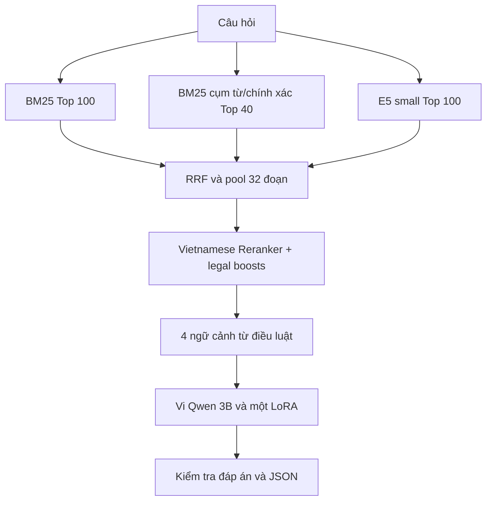

# Thiết kế pipeline LegalQA dưới 4B

Đề xuất này chọn một hệ thống RAG có tổng khoảng 3,80 tỷ tham số kể cả LoRA chưa merge. Mục tiêu là truy xuất được căn cứ, trả lời đủ các ý trong đáp án tham chiếu và đánh giá đúng METEOR của BTC. Không có cơ sở từ năm file để khẳng định một tổ hợp mô hình là mạnh nhất tuyệt đối; cấu hình này là một lựa chọn đủ điều kiện, có thể triển khai và có kế hoạch đo cụ thể.

## Căn cứ từ các tệp

| Tệp | Thông tin sử dụng |
| --- | --- |
| `[DSC@UIT 2026] Danh sách mô hình(2).xlsx` | Danh sách checkpoint được duyệt; chọn 3 model theo URL, không theo tên hiển thị có thể viết khác dấu gạch dưới |
| `DSC2026_Task2_LegalQA_Data_Overview(2).docx` | Input là câu hỏi tiếng Việt; output là câu trả lời văn xuôi; corpus có id/name/link/passage; METEOR chính, ROUGE-L phụ |
| ``UIT Data science challenge`(1).docx`` | Tổng cả hệ thống <4B; không API mô hình, dữ liệu ngoài, tăng cường dữ liệu; không trộn Task 1; phải tái lập được |
| `Scoring-Program-Task-LegalQA(1).zip` | Hàm `eval_qa`, schema reference/prediction và tokenizer ROUGE gốc |
| `tải xuống (8).txt` | Quan sát một lần chạy có 7.000 train/1.000 public, 15 câu hỏi trùng; độ dài và lỗi đầu ra để xác định chỗ cần đo |

Trong log, validation 300 ghi `competition_meteor = 0.3770640331` và `competition_rougeL = 0.4531571043`; số từ trung bình của prediction/reference là khoảng 232,21/364,32. Public output có 53/1.000 câu ở route `recovery_exhausted`, và audit ghi 23 câu chạm token limit ở đầu ra cuối. Đây là kết quả của lần chạy trong **file log**, không phải điểm của pipeline mới. Split cũ không được cung cấp nên không dùng những con số này để tuyên bố mức tăng trực tiếp.

## Đối chiếu quy định

| Yêu cầu BTC trong tài liệu | Cách áp dụng |
| --- | --- |
| Tổng tham số dưới 4 tỷ, gồm lớp embedding | Tính cả ba mô hình và adapter; kiểm tra bằng kiến trúc đầy đủ trước các stage dùng model |
| Chỉ mô hình được phê duyệt | Giữ registry trích từ Excel; mặc định đúng ba URL đã có trong đó |
| LoRA/quantization không biến model lớn thành model ít tham số | Ngân sách tính bằng tham số gốc, thêm tham số adapter dù đang lưu NF4 |
| Không API, kể cả API model miễn phí | Chạy AutoModel/AutoModelForSequenceClassification/AutoModelForCausalLM tại máy; không gọi hosted inference |
| Không dữ liệu ngoài hoặc tăng cường | Chỉ QA và corpus Task 2; mỗi mẫu SFT có đúng câu hỏi và đáp án gốc; không tạo thêm target |
| Không dùng dữ liệu Task 1 cho Task 2 | Chỉ định rõ ba file input Task 2; không lấy nhãn retrieval từ Task 1 |
| Pretrained weights vẫn được dùng | Tải checkpoint được duyệt; không tải thêm dataset từng dùng để pretrain model |
| Hệ thống phải tái lập | Mã nguồn, dependencies, revision, hash dữ liệu, split, config và checkpoint đều được lưu |
| Văn xuôi và đúng cấu trúc submission | Prompt trả lời trực tiếp; đầu ra cuối là `{id: {"answer": str}}`; kiểm tra toàn bộ tập ID và answer |

Chia nhỏ corpus, lập chỉ mục và gắn các trích đoạn truy xuất vào input là bước xử lý RAG; pipeline không tạo câu hỏi/đáp án mới, paraphrase, back-translation, dữ liệu synthetic, teacher API hay nhãn giả để train retriever. Bộ kiểm định CPU có fixture nhỏ để kiểm tra phần mềm; những fixture này không được đưa vào dữ liệu huấn luyện hay chỉ mục cuộc thi.

Model card của Vi-Qwen2-3B-RAG có phần mô tả dùng chung nhắc bản 7B. Không lấy benchmark 7B làm bằng chứng chất lượng của bản 3B. Việc xác định kích thước ở đây dựa trên `config.json` của chính checkpoint 3B và được đếm lại khi chạy.

## Luồng dữ liệu

Huấn luyện: QA gốc của train → lấy ngữ cảnh bằng **question** → đóng prompt theo đúng format inference → dự đoán answer gốc. Nhãn answer không được đưa vào câu truy vấn, không được dùng chọn context ở runtime và không đi vào chỉ mục retrieval. Corpus được cung cấp cho Task 2 được lập chỉ mục toàn bộ vì đó là kho kiến thức của tác vụ, không phải nhãn validation.

## Chuẩn bị dữ liệu và validation

Giữ nguyên target gốc. Chuẩn hóa Unicode và khoảng trắng phục vụ tìm kiếm, nhưng không loại dấu tiếng Việt, không đổi số tiền, năm, số hiệu văn bản hoặc điều khoản trong answer.

Tạo nhóm bằng câu hỏi chuẩn hóa trùng nhau **hoặc** đáp án chuẩn hóa trùng nhau, rồi chia toàn bộ nhóm theo tỷ lệ xấp xỉ 80/10/10 bằng seed 2026. Vì chia theo nhóm, số QA mỗi phần có thể khác tỷ lệ lý tưởng. Với 7.000 QA thường có khoảng 5.600 train, 700 dev, 700 holdout, phải đọc số thực từ `data_report.json`.

`dev30` và `dev100` là các tập con cố định để chạy nhanh. Các câu gần trùng về ý nhưng không trùng chuỗi có thể vẫn qua hai split; code không tuyên bố đã loại mọi dạng leakage. Cần review các trường hợp có cùng tình huống pháp lý và tên riêng khác nhau nếu kết quả tăng bất thường. Một bước tiếp theo hợp lý là bổ sung nhóm near-duplicate trước khi khóa split, rồi chạy lại mọi baseline trên split mới.

## Corpus và truy xuất

Tài liệu đọc được cả ZIP và thư mục lồng `selected-contexts/selected-contexts`. Passage rỗng được ghi số lượng và bỏ khỏi index; passage trùng được giữ một bản. Không sử dụng ID website làm số luật.

Tách parent theo dòng mở đầu “Điều …”. Tài liệu không có cấu trúc điều luật vẫn được giữ và có cửa sổ văn bản để truy xuất. Trong mỗi parent, child mặc định dài 320 token E5, overlap 64; phần số hiệu/tiêu đề tối đa 48 token. Phần kiểm tra input đảm bảo không lén mất nửa child vì E5 chỉ nhận tối đa 512 token.

BM25 dùng SQLite FTS5, giữ dấu và ưu tiên trường tiêu đề/số hiệu. Quality V7 giữ hai nhánh nhẹ trên cùng FTS index: cụm 3–4 từ và truy vấn AND các từ nội dung, giúp các cụm đặc thù như tên biểu mẫu, chức danh hoặc mặt hàng không bị chìm trong truy vấn OR. Dense dùng E5 với tiền tố `query: ` cho câu hỏi, `passage: ` cho văn bản, mean pooling có attention mask và L2 normalization. FAISS dùng inner product trên các vector đã chuẩn hóa. Không có thêm model học tham số.

BM25 thường và dense lấy 100 child; hai nhánh chính xác lấy tối đa 40. RRF kết hợp thứ hạng với hằng số 60; tối đa hai child từ một parent vào pool 32 để giảm các đoạn chồng lấn chiếm hết chỗ. Reranker chấm cặp `(question, child)` với sequence classifier, batch 8, tối đa 768 token. Điểm cuối có các boost nhỏ, được ghi vào retrieval JSON: độ phủ từ nội dung, cụm từ, số hiệu/năm được nêu trực tiếp và ưu tiên năm mới nhất chỉ khi câu hỏi yêu cầu “mới nhất/hiện hành”. Không dùng reference hoặc answer để rerank.

Sau rerank, lấy tối đa bốn parent khác nhau. Mở rộng quanh vị trí child tìm được, ưu tiên đoạn chứa căn cứ thay vì luôn lấy đầu văn bản. Cache giữ một cửa sổ nguyên văn tối đa 24.000 ký tự nếu parent quá lớn; bước đóng prompt tiếp tục giới hạn theo tokenizer của generator. Mỗi context được giữ tối thiểu 256 token, sau đó context hạng đầu nhận trọng số ngân sách 4, hạng hai nhận 2 và các context còn lại nhận 1, tối đa 1.400 token mỗi parent. Tổng prompt tối đa 4.096 token, tính cả role markers và câu hỏi.

Tên slug và URL chỉ được giữ trong audit; số hiệu đưa vào prompt được trích từ dòng “Số:” trong passage. Với văn bản thiếu dòng đó, code không tự suy đoán tên văn bản hay số hiệu từ đuôi URL. Căn cứ xuất hiện nguyên văn trong nội dung vẫn có thể được model sử dụng.

## Fine tune mô hình sinh

Giữ encoder và reranker ở checkpoint được duyệt. Chỉ SFT Vi-Qwen2-3B-RAG. Việc này tập trung vào khác biệt quan sát được trong log: câu trả lời cần đầy đủ hơn và sát cách diễn đạt của reference, nhưng chưa coi thiếu độ dài là nguyên nhân duy nhất của điểm thấp.

| Tham số SFT khởi điểm | Giá trị |
| --- | --- |
| Kiểu | QLoRA NF4, double quantization |
| Compute dtype trên T4 | FP16 |
| LoRA | rank 16, alpha 32, dropout 0,05 |
| Target modules | q/k/v/o, gate/up/down projection |
| Epoch | Đánh giá checkpoint epoch 1 và 2 |
| Learning rate | 5e-5, cosine, warmup 5% |
| Batch và tích lũy gradient | 1 và 16 trên một GPU |
| Sequence training tối đa | 8.192 token |
| Loss | Chỉ trên answer và EOS; toàn bộ prompt mask -100 |

Answer gốc được ưu tiên giữ đầy đủ; prompt có thể thu ngắn để vừa sequence. Nếu cả target và ngữ cảnh tối thiểu không vừa, ghi ID mẫu bị bỏ, không cắt target rồi gắn EOS như thể answer đã đầy đủ. Retrieval phục vụ training cũng chỉ dựa trên câu hỏi, nên không có bước “chọn passage tốt nhất bằng gold answer” rồi vô tình tạo train/inference mismatch. Các mẫu retrieval kém cần được phân tích và sửa ở retrieval, không chữa bằng thêm gold answer vào prompt.

Không mặc định chọn checkpoint có training loss thấp nhất. Sinh answer trên cùng dev, chấm đúng METEOR, giữ một checkpoint có điểm tốt nhất. So sánh cặp baseline/candidate có bootstrap theo câu hỏi để xem cải thiện có tập trung vào một ít ví dụ hay không; interval theo câu có thể lạc quan nếu còn near-duplicate.

## Sinh câu trả lời và kiểm soát lỗi

Greedy decoding, một beam, không sampling. Quality V7 dùng `max_new_tokens=1536`, không có hard cap số từ hoặc quy tắc ép mọi câu về cùng độ dài. Prompt ưu tiên context đầu và cấm trộn quy định giữa các thực thể gần tên. Nếu model mở đầu bằng lời từ chối nhưng context đầu phủ ít nhất 65% từ nội dung của câu hỏi, pipeline dùng source fallback; nếu bằng chứng yếu thì giữ lời từ chối thay vì chép nguồn không liên quan. Ngân sách chưa dùng của parent ngắn được phân phối lại cho các parent sau. Không tra cứu pháp luật hiện hành bên ngoài corpus.

Mọi câu đi qua cùng một route generation. Code không chép answer của hàng xóm KNN và không có classifier được học thêm để định tuyến. Bước cuối bỏ artifact trình bày cơ bản, giữ số hiệu và con số. Ngày dạng `01/08` không bị hiểu nhầm là số hiệu; cụm “không đủ thông tin” trong nội dung một điều kiện pháp lý không bị hiểu nhầm là refusal. Chỉ câu trả lời ngắn mở đầu bằng lời từ chối mới fallback. Nếu output chạm token limit nhưng có các câu hoàn chỉnh, giữ phần hoàn chỉnh với route `generated_truncated`; chỉ dùng đoạn nguồn khi output thật sự rỗng/lỗi/citation không được hỗ trợ hoặc không thể cứu phần hoàn chỉnh.

Fallback nguyên văn chỉ là phương án khôi phục có căn cứ, không bảo đảm trả lời đúng trọng tâm hoặc đạt metric cao. Bộ kiểm tra số hiệu không kiểm chứng được toàn bộ nội dung pháp lý, tính đúng của mọi số tiền hoặc hiệu lực văn bản. Cần review toàn bộ fallback và mẫu thấp điểm. Không âm thầm bỏ đoạn sinh sai citation để tạo cảm giác mô hình đã trả lời đúng.

## Đúng mã chấm BTC

`vendor/scoring.py` và các module `vendor/rouge_score` được lấy nguyên byte từ ZIP gửi kèm. Khi chấm, wrapper chỉ chạy hàm `eval_qa` gốc với các import cần thiết, tránh chạy phần tải NLTK và đường dẫn `/app` của container BTC. Không sửa thuật toán chấm.

Schema khác nhau: prediction là `{id: {"answer": text}}`, còn reference truyền vào `eval_qa` là `{id: text}`. Wrapper trích answer gốc đúng kiểu, không lấy `str(record)` của một dict QA. Kiểm tra tập ID chính xác trước khi chấm, chặt hơn điều kiện chỉ so sánh số lượng trong scorer.

METEOR gọi NLTK với `reference.split()` và `prediction.split()`, dùng các mặc định của NLTK. Không thay bằng token-F1 hoặc `meteor_exact_approx`. NLTK và tài nguyên WordNet phải có sẵn; nếu thiếu, code báo lỗi, không lén chuyển metric.

Mục tiêu chính của pipeline là METEOR ≥ 0,65 trên validation so sánh được. Mọi lựa chọn cấu hình hoặc checkpoint xếp theo METEOR trước; ROUGE-L chỉ là metric phụ dùng khi METEOR hòa. Báo cáo metric luôn ghi `target_met` và khoảng cách `meteor_gap`, nhưng notebook vẫn hoàn tất diagnostics khi chưa đạt mục tiêu.

ROUGE-L giữ nguyên `use_stemmer=False` và tokenizer của ZIP: lower-case, thay các ký tự ngoài `a-z0-9` bằng khoảng trắng. Vì vậy chữ tiếng Việt có dấu bị cắt thành các mảnh ký tự ASCII. Đây là đặc điểm implementation của BTC; không sửa tokenizer khi đánh giá chính thức và cũng không bỏ dấu đáp án để khai thác metric. Có thể thêm phép đo tiếng Việt riêng cho nghiên cứu, nhưng phải đặt tên khác.

File ZIP không pin version NLTK của container chấm. Bộ code pin NLTK 3.9.1, lưu phiên bản thực và fingerprint scorer trong báo cáo. Đã dùng đúng logic scorer được gửi; chỉ có thể xác nhận trùng hoàn toàn môi trường server khi có version image/dependencies từ BTC.

Không có gold context IDs trong mô tả Task 2 và log cung cấp. `diagnose-retrieval` chỉ tính tỷ lệ token answer tìm thấy ở child đã truy xuất để gợi ý chỗ thiếu nội dung. Không gọi nó là Recall@k chuẩn hoặc dùng nó làm chứng cứ chắc chắn tài liệu có liên quan.

## Thứ tự thực nghiệm để đưa vào dự thi

1. Chạy unit tests, kiểm schema thật, audit tổng tham số và một smoke có trọng số thật.
2. Lưu baseline của chính pipeline mới trên dev cố định.
3. Xem lỗi retrieval, số ngữ cảnh bị cắt, tỷ lệ fallback và chạm token limit. Sửa lỗi vận hành trước khi train dài.
4. Chạy SFT; so sánh epoch 1, epoch 2 và baseline bằng METEOR trên cùng dev. ROUGE-L là số đo bổ sung.
5. Khóa cấu hình; chấm holdout một lần. Nếu dùng holdout để sửa tiếp, phần đó trở thành dữ liệu phát triển, không tiếp tục gọi là test độc lập.
6. Sinh toàn bộ public/private bằng cấu hình đã chọn; kiểm ID, nonempty answer, audit và tên JSON trong ZIP; lưu trọn bộ run để tái lập.

Chưa đặt mục tiêu “tăng X điểm” hay “nhanh hơn Y lần”, vì chưa có thực nghiệm tương ứng cho bộ code này.

## Tài liệu kỹ thuật tham chiếu

Những trang sau chỉ dùng xác minh kiến trúc và cách chạy checkpoint, không dùng lấy dữ liệu huấn luyện hoặc căn cứ pháp luật mới.

- https://huggingface.co/AITeamVN/Vi-Qwen2-3B-RAG/blob/main/config.json
- https://huggingface.co/AITeamVN/Vietnamese_Reranker/blob/main/config.json
- https://huggingface.co/intfloat/multilingual-e5-small/blob/main/config.json
- https://huggingface.co/intfloat/multilingual-e5-small
- https://huggingface.co/AITeamVN/Vietnamese_Reranker
- https://huggingface.co/AITeamVN/Vi-Qwen2-3B-RAG
- https://huggingface.co/docs/peft/v0.15.0/developer_guides/quantization
- https://huggingface.co/docs/transformers/v4.51.3/main_classes/trainer
